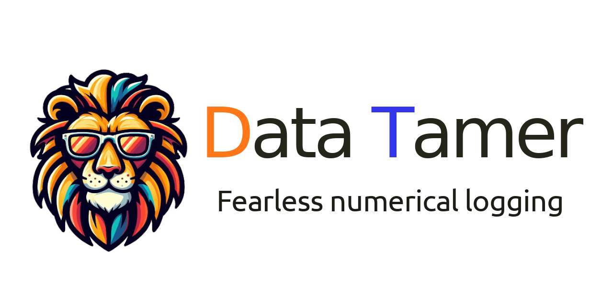
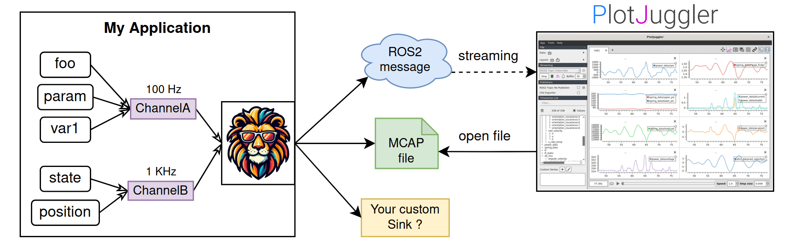

[](https://github.com/facontidavide/data_tamer/actions/workflows/cmake_ubuntu.yml)
[](https://github.com/PickNikRobotics/data_tamer/actions/workflows/ros2.yml)
[](https://codecov.io/gh/facontidavide/data_tamer)
 
**DataTamer** is a library to log/trace numerical variables over time and
takes periodic "snapshots" of their values, to later visualize them as **timeseries**.

It works great with [PlotJuggler](https://github.com/facontidavide/PlotJuggler),
the timeseries visualization tool (note: you will need PlotJuggler **3.8.2** or later).

**DataTamer** is "fearless data logger" because you can record hundreds or **thousands of variables**: 
even 1 million points per second should have a fairly small CPU overhead.

Since all the values are aggregated in a single "snapshot", it is usually meant to 
record data in a periodic loop (a very frequent use case, in robotics applications).

Kudos to [pal_statistics](https://github.com/pal-robotics/pal_statistics), for inspiring this project.

## How it works



DataTamer can be used to monitor multiple variables in your applications.

**Channels** are used to take "snapshots" of a subset of variables at a given time.
If you want to record at different frequencies, you can use different channels.

DataTamer will forward the collected data to 1 or multiple **sinks**; 
a sink may save the information immediately in a file (currently, we support [MCAP](https://mcap.dev/))
or publish it using an inter-process communication, for instance, a ROS2 publisher.

You can easily create your own, specialized sinks.

Use [PlotJuggler](https://github.com/facontidavide/PlotJuggler) to
visualize your logs offline or in real-time.  

## Features

- **Serialization schema is created at run-time**: no need to do code generation.
- **Suitable for real-time applications**: very low latency (on the side of the callee).
- **Multi-sink architecture**: recorded data can be forwarded to multiple "backends". 
- **Very low serialization overhead**, in the order of 1 bit per traced value.
- The user can enable/disable traced variables at run-time.

## Limitations

- Traced variables can not be added (registered) once the recording starts (first `takeSnapshot`).
- Focused on periodic recording. Not the best option for sporadic, asynchronous events.
- If you use `DataTamer::registerValue` you must be careful about the lifetime of the
object. If you prefer a safer RAII interface, use `DataTamer::createLoggedValue` instead.

# Examples

## Basic example

```cpp
#include "data_tamer/data_tamer.hpp"
#include "data_tamer/sinks/mcap_sink.hpp"

int main()
{
  // Multiple channels can use this sink. Data will be saved in mylog.mcap
  auto mcap_sink = std::make_shared<DataTamer::MCAPSink>("mylog.mcap");

  // Create a channel and attach a sink. A channel can have multiple sinks
  auto channel = DataTamer::LogChannel::create("my_channel");
  channel->addDataSink(mcap_sink);

  // You can register any arithmetic value. You are responsible for their lifetime!
  double value_real = 3.14;
  int value_int = 42;
  auto id1 = channel->registerValue("value_real", &value_real);
  auto id2 = channel->registerValue("value_int", &value_int);

  // If you prefer to use RAII, use this method instead
  // logged_real will unregister itself when it goes out of scope.
  auto logged_real = channel->createLoggedValue<float>("my_real");

  // Store the current value of all the registered values
  channel->takeSnapshot();

  // You can disable (i.e., stop recording) a value like this
  channel->setEnabled(id1, false);
  // or, in the case of a LoggedValue
  logged_real->setEnabled(false);

  // The next snapshot will contain only [value_int], i.e. [id2],
  // since the other two were disabled
  channel->takeSnapshot();
}
```
## How to register custom types

Containers such as `std::vector` and `std::array` are supported out of the box.
You can also register a custom type, as shown in the example below.

```cpp
#include "data_tamer/data_tamer.hpp"
#include "data_tamer/sinks/mcap_sink.hpp"
#include "data_tamer/custom_types.hpp"

// a custom type
struct Point3D
{
  double x;
  double y;
  double z;
};

namespace DataTamer
{
template <> struct TypeDefinition<Point3D>
{
  // Provide the name of the type
  std::string typeName() const { return "Point3D"; }
  // List all the member variables that you want to be saved (including their name)
  template <class Function> void typeDef(Function& addField)
  {
    addField("x", &Point3D::x);
    addField("y", &Point3D::y);
    addField("z", &Point3D::z);
  }
}
} // end namespace DataTamer

int main()
{
  auto channel = DataTamer::LogChannel::create("my_channel");
  channel->addDataSink(std::make_shared<DataTamer::MCAPSink>("mylog.mcap"));

  // Array/vectors are supported natively
  std::vector<double> values = {1, 2, 3, 4};
  channel->registerValue("values", &values);

  // Requires the implementation of DataTamer::TypeDefinition<Point3D>
  Point3D position = {0.1, -0.2, 0.3};
  channel->registerValue("position", &position);

  // save the data as usual ...
  channel->takeSnapshot();
}
```

# Compilation

## Compiling with ROS2

Just use colcon :)

## Compiling with Conan (not ROS2 support)

Note that the ROS2 publisher will **NOT** be built when using this method.

Assuming conan 2.x installed. From the source directory.

**Release**:

```
conan install . -s compiler.cppstd=gnu17 --build=missing -s build_type=Release
cmake -S . -B build/Release -DCMAKE_BUILD_TYPE=Release \
      -DCMAKE_TOOLCHAIN_FILE="build/Release/generators/conan_toolchain.cmake"
cmake --build build/Release --parallel
```

**Debug**:

```
conan install . -s compiler.cppstd=gnu17 --build=missing -s build_type=Debug
cmake -S . -B build/Debug -DCMAKE_BUILD_TYPE=Debug \
      -DCMAKE_TOOLCHAIN_FILE="build/Debug/generators/conan_toolchain.cmake"
cmake --build build/Debug --parallel
```

# How to deserialize data recorded with DataTamer

I will write more extensively about the serialization format used by DataTamer, but for the time being I
created a single header file without external dependencies that you can just copy into your project: 
[data_tamer_parser.hpp](data_tamer/include/data_tamer_parser)

You can see how it is used in this example: [mcap_reader](data_tamer/examples/mcap_reader.cpp)


