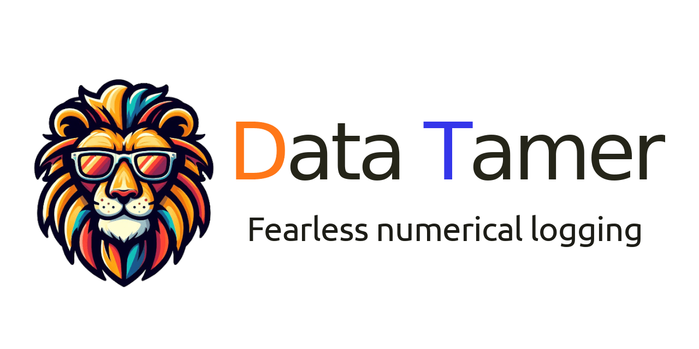
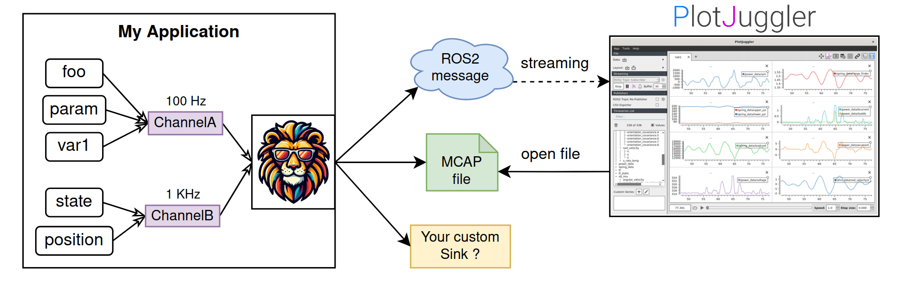

[](https://github.com/facontidavide/data_tamer/actions/workflows/cmake_ubuntu.yml)
[](https://github.com/PickNikRobotics/data_tamer/actions/workflows/ros2-humble.yml)
[](https://github.com/PickNikRobotics/data_tamer/actions/workflows/ros2-jazzy.yml)
[](https://github.com/PickNikRobotics/data_tamer/actions/workflows/ros2-lyrical.yml)
[](https://github.com/PickNikRobotics/data_tamer/actions/workflows/ros2-rolling.yml)
[](https://codecov.io/gh/facontidavide/data_tamer)

**DataTamer** is a library to log/trace numerical variables over time and
takes periodic "snapshots" of their values, to later visualize them as **timeseries**.

It works great with [PlotJuggler](https://github.com/facontidavide/PlotJuggler),
the timeseries visualization tool (note: you will need PlotJuggler **3.8.2** or later).

**DataTamer** is "fearless data logger" because you can record hundreds or **thousands of variables**:
even 1 million points per second should have a fairly small CPU overhead.

Since all the values are aggregated in a single "snapshot", it is usually meant to
record data in a periodic loop (a very frequent use case, in robotics applications).

Kudos to [pal_statistics](https://github.com/pal-robotics/pal_statistics), for inspiring this project.

## How it works



DataTamer can be used to monitor multiple variables in your applications.

**Channels** are used to take "snapshots" of a subset of variables at a given time.
If you want to record at different frequencies, you can use different channels.

DataTamer will forward the collected data to 1 or multiple **sinks**;
a sink may save the information immediately in a file (currently, we support [MCAP](https://mcap.dev/))
or publish it using an inter-process communication, for instance, a ROS2 publisher.

You can easily create your own, specialized sinks: implement `DataTamer::DataSink`
(two callbacks, `onSchema` and `onSnapshot`) and wrap it with `SinkWorker::create<MySink>()`,
which owns the delivery queue and thread. See `data_tamer/sinks/dummy_sink.hpp` for a small one.

Use [PlotJuggler](https://github.com/facontidavide/PlotJuggler) to
visualize your logs offline or in real-time.

## Features

- **Serialization schema is created at run-time**: no need to do code generation.
- **Suitable for real-time applications**: very low latency (on the side of the callee).
- **Multi-sink architecture**: recorded data can be forwarded to multiple "backends".
- **Very low serialization overhead**, in the order of 1 bit per traced value.
- The user can enable/disable traced variables at run-time.

## Limitations

- New traced variables can not be added once the first `takeSnapshot()` attempt
  freezes the schema. A previously removed name may be re-registered after that
  point only with its compatible original type, reusing its schema slot.
- Focused on periodic recording. Not the best option for sporadic, asynchronous events.
- If you use `DataTamer::registerValue` you must be careful about the lifetime of the
object. If you prefer a safer RAII interface, use `DataTamer::createLoggedValue` instead.

## Real-time snapshot contract

- One thread per channel calls `takeSnapshot()`. The first call freezes the schema and
  pre-allocates a pool of 64 snapshots; after that, snapshots do not allocate as long as
  payloads fit their slots. Tune beforehand with `setPoolCapacity()`, `setPayloadCapacity()`
  and `setStrictMode()` (drop oversize snapshots instead of growing).
- Scalar `LoggedValue::set()` / `get()` are wait-free atomics. To capture several values
  together, group the writes:

```cpp
{
  auto tx = channel->scopedWrite();
  logged_real->set(3.2f);
  value_int = 43;  // raw registered values share the same mutex
}
```

- Non-scalar values lock automatically. Keep transactions and pointer guards short: the
  snapshot thread waits on them.
- Backpressure counters: `poolExhausted()`, `droppedSnapshots(sink)`, `payloadReallocations()`,
  `droppedOversize()`, or all at once with `stats()`.
- Registering, unregistering and changing sinks are safe while logging, but call them outside
  `scopedWrite()` and sink callbacks.

The library is built as C++20; its public headers need only C++17 from consumers.
Details in [CHANGELOG.rst](data_tamer_cpp/CHANGELOG.rst); measurements in
[docs/benchmarks](docs/benchmarks/2026-09-12-main-vs-lockfree-frontend.md).

# Examples

## Basic example

```cpp
#include "data_tamer/data_tamer.hpp"
#include "data_tamer/sinks/mcap_sink.hpp"

int main()
{
  // Multiple channels can use this sink. Data will be saved in mylog.mcap
  auto mcap_sink = DataTamer::MCAPSink::create("mylog.mcap");

  // Create a channel and attach a sink. A channel can have multiple sinks
  auto channel = DataTamer::LogChannel::create("my_channel");
  channel->addDataSink(mcap_sink);

  // You can register any arithmetic value. You are responsible for their lifetime!
  double value_real = 3.14;
  int value_int = 42;
  auto id1 = channel->registerValue("value_real", &value_real);
  auto id2 = channel->registerValue("value_int", &value_int);

  // If you prefer to use RAII, use this method instead
  // logged_real will unregister itself when it goes out of scope.
  auto logged_real = channel->createLoggedValue<float>("my_real");

  // Store the current value of all the registered values
  channel->takeSnapshot();

  // You can disable (i.e., stop recording) a value like this
  channel->setEnabled(id1, false);
  // or, in the case of a LoggedValue
  logged_real->setEnabled(false);

  // The next snapshot will contain only [value_int], i.e. [id2],
  // since the other two were disabled
  channel->takeSnapshot();
}
```
Scalar `LoggedValue::set()` and `get()` use relaxed atomics. Each value is
read without tearing, but separate writes can appear in different snapshots.
To capture several updates together, use one logged struct or a transaction:

```cpp
{
  auto tx = channel->scopedWrite();
  logged_real->set(3.2f);
  value_int = 43;  // a raw registered value uses the same write mutex
}
channel->takeSnapshot();
```

Non-scalar `set()`/`get()` lock automatically and can be called inside
`scopedWrite()`. Keep transactions short and take snapshots after releasing
them. Non-scalar pointer proxies also hold the write mutex; release them before
starting a transaction or taking a snapshot.

## How to register custom types

Containers such as `std::vector` and `std::array` are supported out of the box.
You can also register a custom type, as shown in the example below.

```cpp
#include "data_tamer/data_tamer.hpp"
#include "data_tamer/sinks/mcap_sink.hpp"
#include "data_tamer/custom_types.hpp"

// This is your custom type
namespace MyNamespace
{
struct Point3D
{
  double x;
  double y;
  double z;
};
} // end namespace MyNamespace

// You must implement the function TypeDefinition in the same namespace as Point3D
namespace MyNamespace
{
template <typename AddField>
std::string_view TypeDefinition(Point3D& point, AddField& add) {
  add("x", &point.x);
  add("y", &point.y);
  add("z", &point.z);
  return "Point3D";
}
} // end namespace MyNamespace

int main()
{
  auto channel = DataTamer::LogChannel::create("my_channel");
  channel->addDataSink(DataTamer::MCAPSink::create("mylog.mcap"));

  // Array/vectors are supported natively
  std::vector<double> values = {1, 2, 3, 4};
  channel->registerValue("values", &values);

  // Requires the implementation of DataTamer::TypeDefinition<Point3D>
  Point3D position = {0.1, -0.2, 0.3};
  channel->registerValue("position", &position);

  // save the data as usual ...
  channel->takeSnapshot();
}
```

# Compilation

## Compiling with ROS2

Just use colcon :)

## Compiling with Conan (not ROS2 support)

Note that the ROS2 publisher will **NOT** be built when using this method.

Assuming conan 2.x installed. From the source directory.

**Release**:

```
conan install . -s compiler.cppstd=gnu17 --build=missing -s build_type=Release
cmake -S . -B build/Release -DCMAKE_BUILD_TYPE=Release \
      -DCMAKE_TOOLCHAIN_FILE="build/Release/generators/conan_toolchain.cmake"
cmake --build build/Release --parallel
```

**Debug**:

```
conan install . -s compiler.cppstd=gnu17 --build=missing -s build_type=Debug
cmake -S . -B build/Debug -DCMAKE_BUILD_TYPE=Debug \
      -DCMAKE_TOOLCHAIN_FILE="build/Debug/generators/conan_toolchain.cmake"
cmake --build build/Debug --parallel
```

# How to deserialize data recorded with DataTamer

The wire format is specified in [docs/wire_format.md](docs/wire_format.md), with golden
byte vectors under `docs/wire_format/vectors/` that the test suite checks on every run.
Two reference decoders implement it:

- C++, a single header without external dependencies that you can copy into your project:
  [data_tamer_parser.hpp](data_tamer_cpp/include/data_tamer_parser/data_tamer_parser.hpp),
  used in [mcap_reader](data_tamer_cpp/examples/mcap_reader.cpp).
- Python, standard library only: [python/data_tamer_parser.py](python/data_tamer_parser.py).
